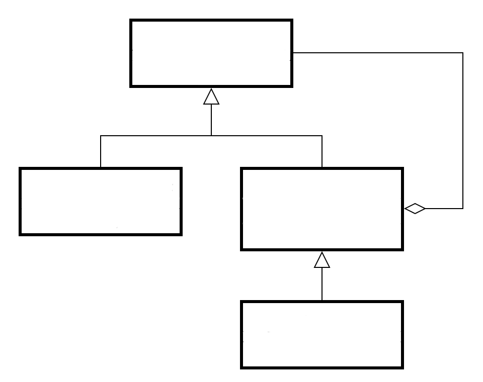

  </a>

## Design patterns

### Behavioral patterns

#### Command

Encapsulates a request as an object, thereby allowing for the parameterization of clients with different requests, and the queuing or logging of requests. It also allows for the support of undoable operations.

#### Iterator

Provides a way to access the elements of an aggregate object sequentially without exposing its underlying representation.  

#### Null object

Avoids null references by providing a default object.  

#### Observer

Defines a one-to-many dependency between objects where a state change in one object results in all its dependents being notified and updated automatically.  

#### State

Allows an object to alter its behavior when its internal state changes. The object will appear to change its class.  

#### Strategy

Defines a family of algorithms, encapsulate each one, and make them interchangeable. Strategy lets the algorithm vary independently from clients that use it.  

#### Template method

Defines the skeleton of an algorithm in an operation, deferring some steps to subclasses. Template method lets subclasses redefine certain steps of an algorithm without changing the algorithm's structure.  

### Creational patterns

#### Abstract factory

Provides an interface for creating families of related or dependent objects without specifying their concrete classes. 

#### Factory method

Defines an interface for creating a single object, but let subclasses decide which class to instantiate. Factory Method lets a class defer instantiation to subclasses.   

#### Singleton

Ensures a class has only one instance, and provides a global point of access to it.  

### Structural patterns

#### Adapter

Converts the interface of a class into another interface clients expect. An adapter lets classes work together that could not otherwise because of incompatible interfaces. The enterprise integration pattern equivalent is the translator.  

#### Bridge

Decouples an abstraction from its implementation so that the two can vary independently.  

#### Composite

Composes objects into tree structures to represent part-whole hierarchies. Composite lets clients treat individual objects and compositions of objects uniformly.

#### Decorator

Attaches additional responsibilities to an object dynamically keeping the same interface. Decorators provide a flexible alternative to subclassing for extending functionality.  

#### Facade

Provides a unified interface to a set of interfaces in a subsystem. Facade defines a higher-level interface that makes the subsystem easier to use.  

#### Proxy

Provides a surrogate or placeholder for another object to control access to it.  

### Sources:  

* [List of patterns and their UML diagrams](https://java-design-patterns.com/)
* [List of patterns and their simple explainations](https://github.com/kamranahmedse/design-patterns-for-humans)
* [Patterns explained in video form](https://www.youtube.com/playlist?list=PLrhzvIcii6GNjpARdnO4ueTUAVR9eMBpc)